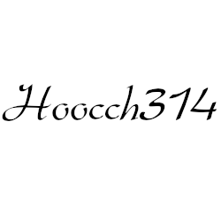

MOMC:
------ 

  
  <h5>Blood on the Sand</h5>

<h5>U</h5>

<h5>Heavy</h5>

  <h5><a href="Game Instructions/Hoocch314 Instructions.pdf">Hoocch314</a></h5>

  
  <h5><a href="#">Throw Those Knucklebones</a></h5>

  
  

    <h5>Blood on the Sand</h5>

  
 
